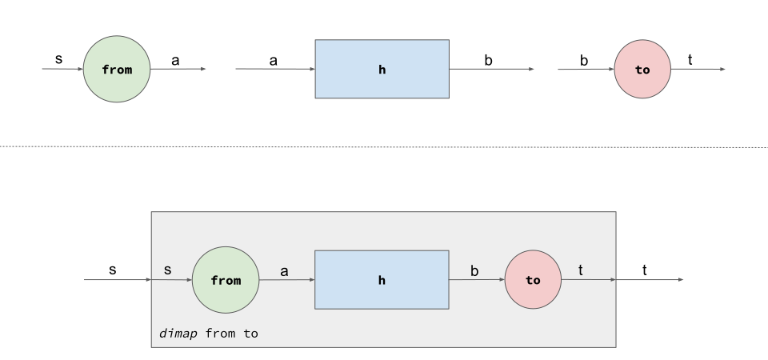
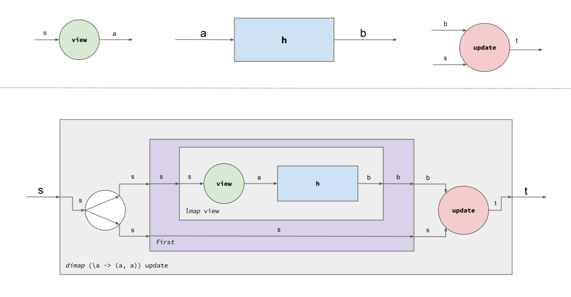
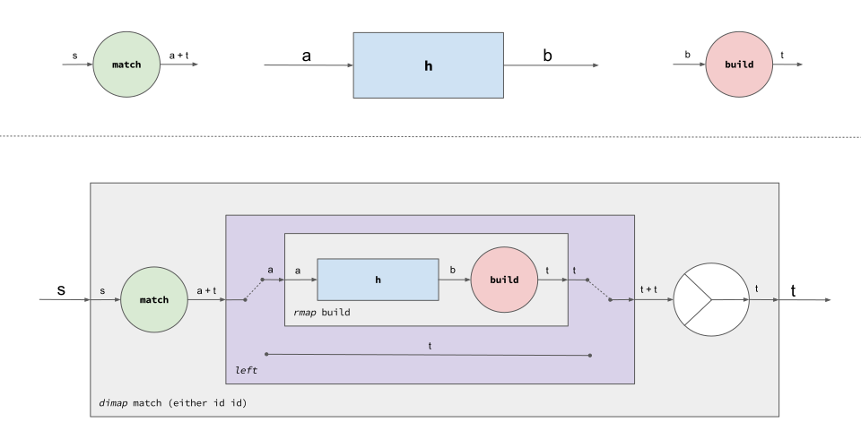

<!-- 70 sentences? -->
<!-- The screen ratio for slides is 16:9  -->

# Profunctor User Interfaces

Eryk Ciepiela

---
# Profunctors

```
class Profunctor p where
  dimap :: (s -> a) -> (b -> t) -> p a b -> p s t

-- such that:
-- dimap id id = id
-- dimap (f'. f) (g . g') = dimap f g . dimap f' g'
```

---
## Profunctors encode optics

Adapter `(s -> a, b -> t)`
isomorphic to `forall a. Profunctor p => p a b -> p s t`

Lens `(s -> a, s -> b -> t)`
isomorphic to `forall a. CartesianProfunctor p => p a b -> p s t`

Prism `(s -> Either t a, b -> t)`
isomorphic to `forall a. CocartesianProfunctor p => p a b -> p s t` etc.

Isomorphism - polymorphic profunctor modifiers are equivalent to optics

Polymorphism - not specific to any profunctor instance

Composition - function composition

> "Profunctor Optics. Modular Data Accessors" by Matthew Pickering, Jeremy Gibbons, and Nicolas Wu

---
### Adapter is a polymorphic profunctor modifier



> "Don't fear the profunctor optics" by Jesús López-González, https://github.com/hablapps/DontFearTheProfunctorOptics

---
### Lens is a polymorphic profunctor modifier

<!-- `(s -> a, s -> b -> t)` as
`forall a. CartesianProfunctor p => p a b -> p s t` -->

```
class Profunctor p => CartesianProfunctor p where
  first  :: p a b -> p (a, c) (b, c)

-- such that:
-- dimap (\(x, y) -> x) id = dimap id (\(x, y) -> x) . first
-- dimap (mapSnd f) id . first = dimap id (mapSnd f) . first
-- first . first = dimap assoc unassoc . first
```



<!-- > "Don't fear the profunctor optics" by Jesús López-González, https://github.com/hablapps/DontFearTheProfunctorOptics -->

---
### Prism is a polymorphic profunctor modifier

```
class Profunctor p => CocartesianProfunctor p where
  left  :: p a b -> p (Either a c) (Either b c)

-- such that:
-- dimap id Left = dimap Left id . left
-- dimap (mapRight f) id . left = dimap id (mapRight f) . left
-- left . left ≡ dimap assoc unassoc . left
```



---
### Polymorphic profunctor modifiers compose as functions do

```
fulfillment . delivery . address . street
  :: forall p.
     CartesianProfunctor p =>
     CocartesianProfunctor p =>
     p Street Street ->
     p Order Order
```
Lenses `fulfillment` and `street` involved
Prisms `delivery` and `address` involved
Constraints of `CartesianProfunctor` and `CocartesianProfunctor` add

---
## Profunctors encode arrow-like computations

For `ArrowChoice` plus `dimap`, minus `arr`, minus `id`

* Introducing `dimap`
  * enables "data plumbing" between arrows
  * excludes some instances - should not be the case for a type denoting a computation?
* Eliminating `arr`
  * disables "data plumbing" as first-class citizen - should not be the case either?
  * includes more instances
* Eliminating `id`
  * disables _no-op_ as first-class citizen - should not be the case either?
  * includes more instances

---
## Profunctors encode arrow-like computations

```
class CartesianProfunctor a, CocartesianProfunctor a, Semigroupoid a =>
  ArrowLike a
```

* disabled power vs.. enabled more instances as compared to arrows
* simpler laws as compared to arrows
* `dimap`, `left`, `second`, `.` required
* `lmap`, `rmap`, `second`, `right`, `***`, `+++` derivable

---
## Profunctors are a common fabric for data and computation structure

Arrows structure computations

Optics structure data

All based on profunctors

Why it's technically not true in the Haskell ecosystem?

---
## Profunctors as a fabric for optics were discovered late

When optics were first discovered they didn't mention profunctors.
Chronologically, there was
  * concrete (explicit) encoding,
  * van Laarhoven encoding proposed in 2009
  * profunctor encoding published in 2017

> "CPS functional references" by Twan Van Laarhoven https://www.twanvl.nl/blog/haskell/cps-functional-references
> "Profunctor Optics. Modular Data Accessors" by Matthew Pickering, Jeremy Gibbons, and Nicolas

---
## Profunctors as a fabric for arrows is not Haskell mainstream

Haskell `arrows` package from 2001 predates the `profunctors` package founded in 2011.

The `Control.Arrow` module made it to the `base` package in 2005.
`profunctors` is not in the `base` to this day.

That's why the `Arrow` class is not, and is not likely to be in the future, a subclass of the `Profunctor` class in Haskell.

> "Generalising Monads to Arrows" by John Hughes

---
## Profunctor encoding of optics is the default one in PureScript

Profunctors in Haskell were about 10 years late.

They were late in optics and arrows domains.

Optics in PureScript ecosystem, however, are based on profunctors.

> Package `purescript-profunctor-lenses` https://pursuit.purescript.org/packages/purescript-profunctor-lenses

---
## Profunctor encoding of arrows is the default one in PureScript

Luckily, in a sense, PureScript hadn't got arrows earlier than profunctors.

Once it had got profunctors, arrows were deemed no longer necessary.

In PureScript ecosystem, cartesian (strong) profunctor category is a synonym for an arrow.

> Package `purescript-profunctor` https://pursuit.purescript.org/packages/purescript-profunctor

---
# Are profunctors suitable for UIs?

Recap: Profunctors model both data structures and data flow

Can profunctors model UIs?

- Declarative/reactive owing to composablity of profunctors
- Separating business and presentation owing to optics
- Requiring only a basic building block that supports `dimap`, `left`, `first`, `.` etc
- Viable alternative to Functional Reactive Programming, Virtual Dom, The Elm Architecture, ...?

**PureScript Web UI framework?**

---
## `UI` is the generic basic building block

```
newtype UI m i o = UI (m
  { toUser   :: New i                  -> Effect Unit
  , fromUser :: (New o -> Effect Unit) -> Effect Unit
  })

instance Functor m     => Profunctor   (UI m)
instance Functor m     => Strong       (UI m) -- cartesian profunctor
instance Functor m     => Choice       (UI m) -- cocartesian profunctor
instance Apply m       => Semigroupoid (UI m) -- category sans identity
instance Apply m       => Endo         (UI m) -- see below
instance Apply m       => Sum          (UI m) -- see below
instance Applicative m => Zero         (UI m) -- see below
```

> Prototype of the idea of profunctor user interfaces for PureScript Web UIs  https://github.com/restaumatic/bambik


---
## `Endo`, `Sum` and `Zero` typeclasses are missing in `purescript-profunctor` package but they are useful

```
class Profunctor p <= Endo p where
  pendo :: forall a. p a a -> p a a -> p a a
  -- such that `pendo p (pendo q r) == pendo (pendo p q) r`

class Profunctor p <= Sum p where
  psum :: forall a b . p a b -> p a b -> p a b
  -- such that `psum a (psum b c) == psum (psum a b) c

class Sum p <= Zero p where
  pzero :: forall a b. p a b
  -- such that `psum pzero p == p == psum p pzero`
```

> Prototype of the idea of profunctor user interfaces for PureScript Web UIs  https://github.com/restaumatic/bambik

---
## `UI Web` is the basic building block for Web UI

```
newtype Web a = Web (StateT DOM Effect a)

text       :: forall a. UI Web String a

textInput  :: UI Web String String

button     :: forall a. UI Web a a

p          :: forall a b. UI Web a b -> UI Web a b

div        :: forall a b. UI Web a b -> UI Web a b

staticText :: forall a b. String -> UI Web a b
```

> Prototype of the idea of profunctor user interfaces for PureScript Web UIs  https://github.com/restaumatic/bambik

---
## Plain HTML is possible with `UI Web`

```
helloWorld :: forall a b. UI Web a b
helloWorld =
  div Sum.do
    p $ staticText "Hello World!"
    ul Sum.do
      li $ staticText "One"
      li $ staticText "Two"
      li $ staticText "Three"
    a >>> "href" := "https://www.google.com" $ staticText "Search for me!"
    staticHTML "<hr/>"
```

> `Sum.do` does `psum :: forall a b . Sum p => p a b -> p a b -> p a b` composition powered by PureScript *qualified do* feature

---
## Material Design Components are possible with `UI Web`

```
filledTextField :: { floatingLabel :: String } -> UI Web String String

containedButton :: forall a. { label :: String } -> UI Web a a

card :: forall a b. UI Web a b -> UI Web a b

caption :: forall a b. UI Web a b -> UI Web a b

submitName :: UI Web String String
submitName = Semigroupoid.do
  card Sum.do
    caption $ staticText "What is your name?"
    filledTextField { floatingLabel: "Name" }
  containedButton { label: "Submit" }
```

> `Semigroupoid.do` does `>>> :: forall a b c . Semigroupoid p => p a b -> p b c -> p a c` composition via PureScript *qualified do* feature

---
## Data structures are enabled by `Endo.do`

```
shortId  :: Lens Order Order String String
uniqueId :: Lens Order Order String String

identifierForm :: Web UI Order Order
identifierForm =
  card Endo.do
    caption $ staticText "Identifier"
    shortId $ filledTextField { floatingLabel: "Short ID" }
    orderId $ filledTextField { floatingLabel: "Unique ID" }
```

> `Endo.do` does `pendo :: forall a. Endo p => p a a > p a a -> p a a` composition via PureScript *qualified do* feature

---
## Data flows are enabled by `Semigroupoid.do` and `Sum.do`

```
authorization :: Lens Order AuthorizedOrder OrderSummary AuthToken
orderSubmission :: Lens AuthorizedOrder Boolean Boolean Void
orderSubmissionFailed :: Prism Boolean Unit Unit Void

submitOrder :: Web UI Order Void
submitOrder = Semigroupoid.do
  containedButton { label: "Submit order" }
  authorization $ simpleDialog { title: "Authorization" } Sum.do
    caption Sum.do
      staticText "Order summary: "
      summary text
    filledTextField { floatingLabel: "Authorization token" }
  orderSubmission indeterminateLinearProgress
  orderSubmissionFailed $ snackbar $ staticText "Order submission failed"
  snackbar $ staticText "Order submitted"
```
---
## "Business" and "design" are orthogonal optics

Recap:

```
type Optic p s t a b = p a b -> p s t
```

Dealing with business, design is transparent:

```
type Lens s t a b    = forall p.   Strong p => Optic p s t a b
type Prism s t a b   = forall p.   Choice p => Optic p s t a b
-- etc.
```

Dealing with design, business is transparent:

```
type Ocular p        = forall a b.             Optic p a b a b
```

---
## "Business" vs. "design" separation is clear with optics

```
module Business where
firstName :: Lens String String Person Person
lastName  :: Lens String String Person Person
```
```
module Design where
textInput :: UI Web String String
card      :: Ocular (UI Web)
```
```
module UI where
import Business
import Design
personForm :: UI Web Person Person
personForm =
  card Endo.do
    firstName textInput
    lastName textInput
```

---
## Building complex UI is easy 

It involves only:
  * design system basic building blocks and oculars
  * business lenses, prisms etc
  * composition of building blocks with `Endo.do`, `Sum.do`, `Semigroupoid.do` blocks
  * `>>>`, `pempty`, `$`, `(` and `)`

as in this [MDC form example](http://erykciepiela.xyz/bambik/demo/1/) ([code](https://github.com/restaumatic/bambik/blob/main/demo/1/Demo1/Main.purs)).

---
# Profunctors are suitable for UIs

  * At least for specific classes of UIs
  * Both for dealing with data structures and data flow
  * Clearly separates business and design 
  * Declarative, reactive
  * Provides easy and scalable mental model
  * Offers simple API
  * More research and development is needed

---
# Thank you!

Eryk Ciepiela